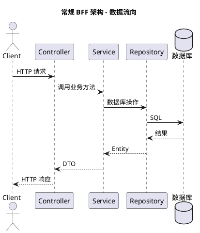
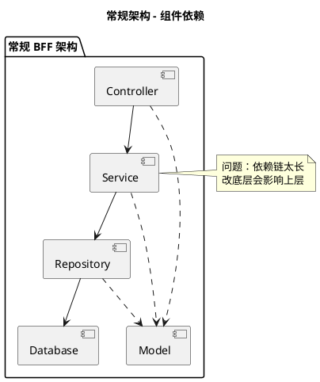
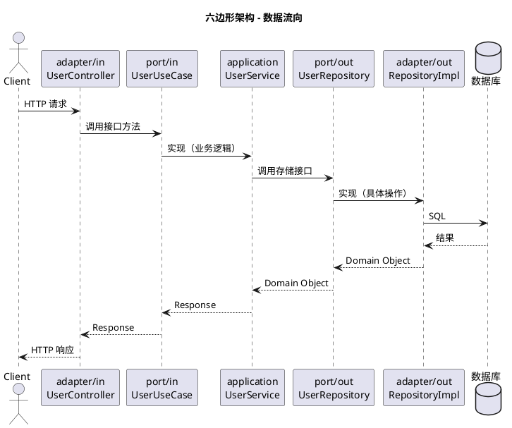
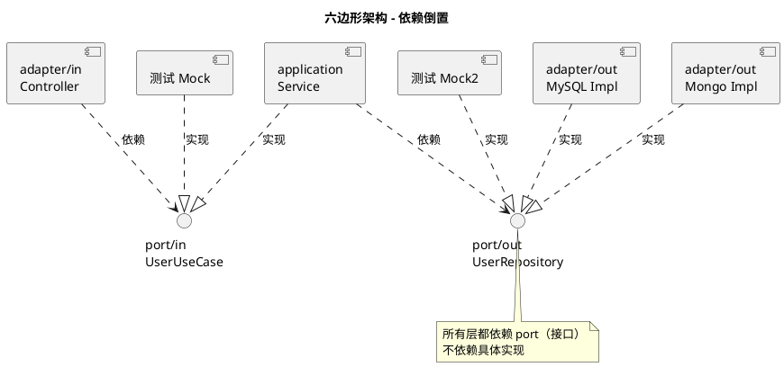
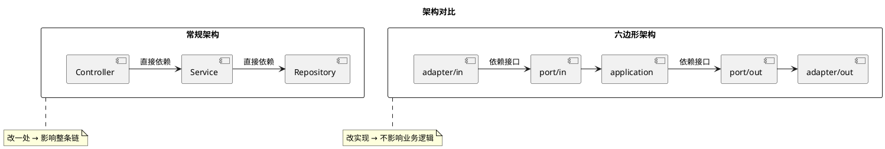
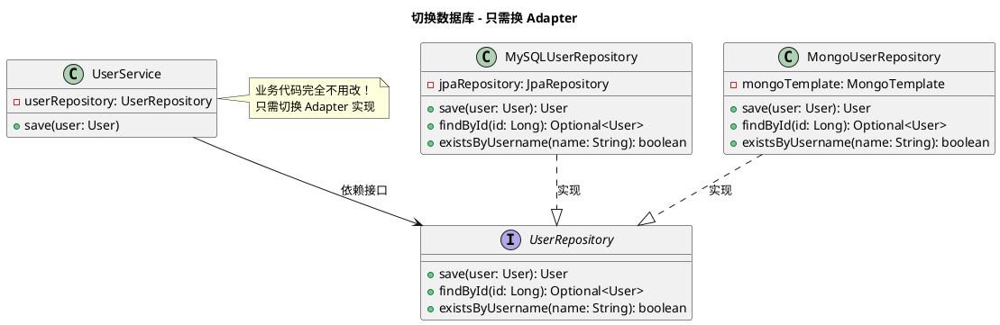
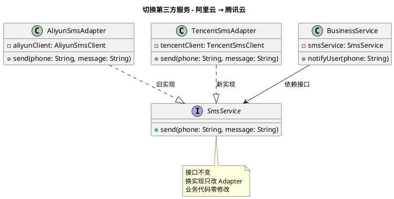
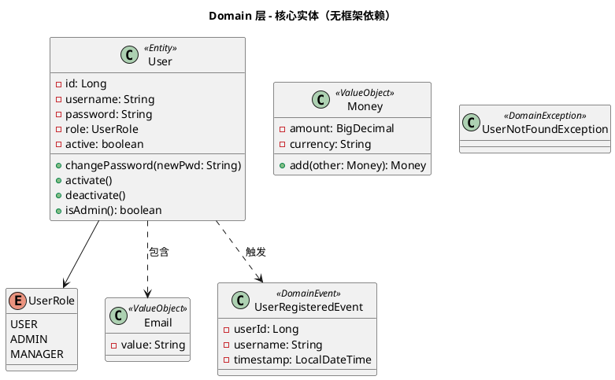

# 架构图（PlantUML / UML 版）

> 查看方式：VSCode 装 `PlantUML` 插件 → 打开 `.puml` 文件 → `Alt+D` 预览
> 或在线渲染：https://www.plantuml.com/plantuml/uml

---

## 一、常规 BFF 架构 - 数据流向



## 二、常规架构 - 组件依赖图



## 三、六边形架构 - 数据流向（时序图）



## 四、六边形架构 - 完整分层（组件图）

```plantuml
@startuml
title 六边形架构 - 分层组件图

package "adapter" {
    package "adapter/in" {
        [UserController]
    }
    package "adapter/out" {
        [UserRepositoryAdapter]
        [SendGridEmailAdapter]
    }
}

package "port" {
    package "port/in" {
        interface UserUseCase
    }
    package "port/out" {
        interface UserRepository
        interface EmailService
    }
}

package "application" {
    [UserService]
}

package "domain" {
    class User {
        - id: Long
        - username: String
        - password: String
        - role: UserRole
        - active: boolean
        + changePassword(newPwd)
        + activate()
        + deactivate()
        + isAdmin(): boolean
    }
    class Money <<ValueObject>> {
        - amount: BigDecimal
        - currency: String
        + add(other): Money
    }
    class UserRegisteredEvent <<DomainEvent>>
    enum UserRole {
        USER
        ADMIN
        MANAGER
    }
}

[UserController] ..> UserUseCase : 依赖
[UserService] ..|> UserUseCase : 实现
[UserService] ..> UserRepository : 依赖
[UserService] ..> EmailService : 依赖
[UserRepositoryAdapter] ..|> UserRepository : 实现
[SendGridEmailAdapter] ..|> EmailService : 实现
[UserService] ..> User : 使用
@enduml
```

## 五、六边形架构 - 依赖关系（可替换实现）



## 六、两种架构对比



## 七、切换数据库（类图）



## 八、切换第三方服务（类图）



## 九、Domain 层类图


